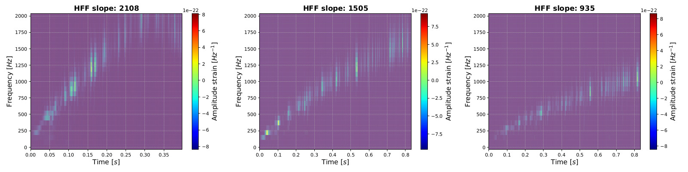

# Summary

Dataset generator of strain (time series) samples containing phenomenological gravitational waves from core-collapse supernovae added to noise from LIGO-Virgo interferometric detectors. Jupyter notebooks developed in Python and written by Manuel D. Morales (e-mail: <manueld.morales@academicos.udg.mx>).


# Science background

<b><ins>Interferometric noise</ins></b>

For this implementation, we used real noise from LIGO (L1, H1) and Virgo (V1) interferometric detectors from O3b run. This is a non-Gaussian and non-stationary noise stored in strain time series of 4,096s of duration, sampled at 16,384Hz and 4,096Hz. For our implementation, we choose the second sampling option. Data available on the [Gravitational Wave Open Science Center](https://gwosc.org/).

<b><ins>Phenomenological waveforms</ins></b>

We draw on CCSN phenomenological waveforms. These were generated by the [SignalGenerator_Phen](https://github.com/CesarTiznado/SignalGenerator_Phen) code, following the model first proposed by [Astone et al Phys. Rev. D 98, 122002 (2018)](https://doi.org/10.1103/PhysRevD.98.122002). This simplified stochastic non-physical model mimics one of the features common in GW signals obtained from all multi-dimensional general relativistic CCSN simulations, namely the high-frequency feature (HFF) -commonly called as "g-mode". In the time-frequency representation (such as that provided by spectrograms and scalograms), the HFF has an increasing monotonically frequency profile in time, which, at first order, can be considered linear. Based on state-of-the-art CCSN models, the HFF feature is thought to carry information about the pulsation of the proto-neutron star created in the CCSN. We draw on three sets of phenomenological waveforms:

- 200 waveforms with 1,620 =< HFF slope =< 4,990 (class 1)
- 200 waveforms with 1,450 =< HFF slope < 1,620 (class 2)
- 200 waveforms with 950 =< HFF slope < 1,450 (class 3)

Fig. 1 shows three representative phenomenological waveforms in the time-frequency domain.


<b>Figure 1</b>. Scalograms (based on a Morlet Wavelet Transform) of three phenomenological waveforms.

# Implementation structure

```
datagen-sngw-phen
|___ Codes
     |___ Noise_Explorer.ipynb
     |___ Populations_Explorer.ipynb
     |___ Prepare_Waveforms.ipynb
     |___ Process_PhenWaveforms.ipynb
     |___ Toolbox.py
     |___ WaveformPhen_Explorer.ipynb
|___ Datasets
|___ Pictures
|___ Waveforms_mod
     |___ Phen
|___ Waveforms_orig
     |___ Phen
|___ LICENCE
|___ README.md
```

Run the Jupyter notebooks in the following order:

`Noise_Explorer.ipynb` for downloading interferometric noise data from LIGO and Virgo detectors (segments of 4,096s), exploring time series and power spectral densities, and locally saving noise segments. Open data was obtained from the website of the GWOSC.

`WaveformPhen_Explorer.ipynb` for analyzing three representative waveforms; exploring their morphologies in the time domain and the time-frequency domain. Spectrograms (applying short-time Fourier transform) and scalograms (applying Morlet wavelet transform) are plotted.

`Prepare_Waveforms.ipynb` for resampling and rescaling all phenomenological waveforms, resulting in dimensionless strain time series with a sampling frequency of 4,094Hz. Modified waveforms are saved as dictionaries, separated by class.

`Process_PhenWaveforms.ipynb` for applying injections, data conditioning (whitened, band-pass filtering), and generating a dataset of window strain samples. Each one of these windows has the same length Twin<4,096s, contains noise plus a phenomenological waveform, and is saved in a .txt file. In addition, a log.dat file is saved which contains information about injected signals in all windows.

`Populations_Explorer.ipynb` for exploring the distribution of SNR values, HFF slopes, waveform durations, and frequency ranges f1-f0 of the HFF. This information is loaded from log.data file. SNR values are computed from the strain samples containing noise, and other quantities from waveforms before being injected.

In addition, the code `Toolbox.py` is included, which contains specific functions for the notebooks.

# Important instructions

1. All scripts were run locally, then you will need to edit path locations in cells for read files. The set of 600 phenomenological waveforms used in this work is available in the public folder [Waveforms_orig](https://drive.google.com/drive/folders/1GuOWzGEHlAedqWZcCAShcAanpDnC1bIy?usp=sharing). Download this folder and locate it in your local machine as shown in the tree detailed in implementation structure.

2. In the input of `Prepare_Waveforms.ipynb` script, you can change the rescaling factor (Resc_factor) to change the SNR values of injected signals. Depending on this rescaling factor (and the noise realization), the distribution of SNR values can change. To explore this distribution, run the `Populations.ipynb` script.

3. In `Process_PhenWaveforms.ipynb`, a random combination of waveforms is selected to be injected in a noise strain data segment. Each injection is performed in a location inj_time +/- jitter (in seconds), in which jitter is a random value in the range [inj_time - jitter_lim, inj_time + jitter_lim]. Jitter_lim is also an input parameter that can be set in subsection 2.1 (ensure that jim_lim << dt_inj).

4. The time window duration of window strain samples is Twin = wf_max + alpha, where wf_max is the duration of the longest injected waveform, and alpha is an input parameter. Then, to change window duration, change alpha input parameter in subsection 4.1 of `Process_PhenWaveforms.ipynb` script.

5. Before running `Process_PhenWaveforms.ipynb` to perform injections (and to generate window samples) covering a whole noise segment of 4,096s, it is highly recommendable to apply it only on a reduced segment of a few tens of seconds. To perform this check, set reduce_segment=1 and reduced_time_n equal to the duration (in seconds) of the reduced segment, in subsection 2.1 of the script.
   
6. For the check previously mentioned, it is also useful to set input parameters doplot_spectrogram=1 (subsection 3.4.1) and set_doplots=1 (subsection 4.1). This output plots of windows samples in time and time-frequency domains. Only set this when working with a reduced segment; outputting plots working with the complete segment of 4,096s considerably slows down the script execution.

7. To correctly explore populations in `Populations.ipynb` script, you need to generate a dataset containing window strain samples belonging to the three classes, that is to say, run `Process_PhenWaveforms.ipynb` three times, for each class (set in waveform_class input parameter, subsection 2.1).  

8. Saving plots as images is not mandatory in the codes. However, if you want it, you will need to create a folder "Figures" at the highest folder hierarchy of the project, and to uncomment line(s) with the plt.savefig statements in the scripts, for the desired plot(s).
